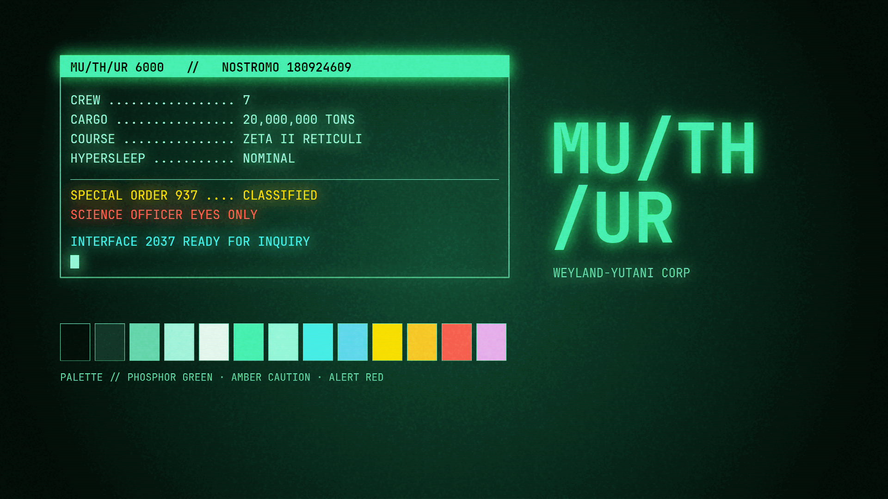

# MUTHUR — MU/TH/UR 6000

> *"You are my resolution."*

A dark terminal theme for [Omarchy](https://omarchy.org) inspired by the onboard computer of the USCSS Nostromo. Phosphor green on deep black — the look of a CRT console running a secret directive at 0300 hours.



## Palette

The palette is built around three phosphor green tones and a set of alert colors drawn from the ship's warning system.

| Role | Hex | |
|---|---|---|
| Background | `#010A07` | Deep CRT black |
| Foreground | `#63F2A0` | Phosphor green |
| Accent | `#2BE86B` | Bright phosphor |
| Muted | `#4A7A62` | Dim terminal |
| Selection | `#0E3D28` | Highlight band |
| Red (alert) | `#FF3B30` | Emergency |
| Yellow (warning) | `#FFB000` | Caution |
| Cyan | `#2BE0C8` | Secondary display |

## Backgrounds

Seven wallpapers themed around the Nostromo mission, generated from the palette:

- `0-special-order-937` — the directive that started everything
- `1-interface` — MUTHUR terminal grid
- `2-story-mother` — narrative overlay
- `3-emergency-destruct` — self-destruct countdown pattern
- `4-lv426-beacon` — signal noise from the surface
- `5-building-better-worlds` — Weyland-Yutani corp aesthetic
- `6-phosphor` — pure phosphor scanlines

## Install

```bash
omarchy theme install https://github.com/santiago-giordano/omarchy-muthur-theme.git
omarchy theme set muthur
```

## What's included

| File | Purpose |
|---|---|
| `colors.toml` | Full Omarchy color palette |
| `icons.theme` | Icon theme (Yaru prussian green dark) |
| `btop.theme` | btop system monitor theme |
| `backgrounds/` | 7 themed wallpapers |
| `preview.png` | Theme preview screenshot |

## License

MIT
